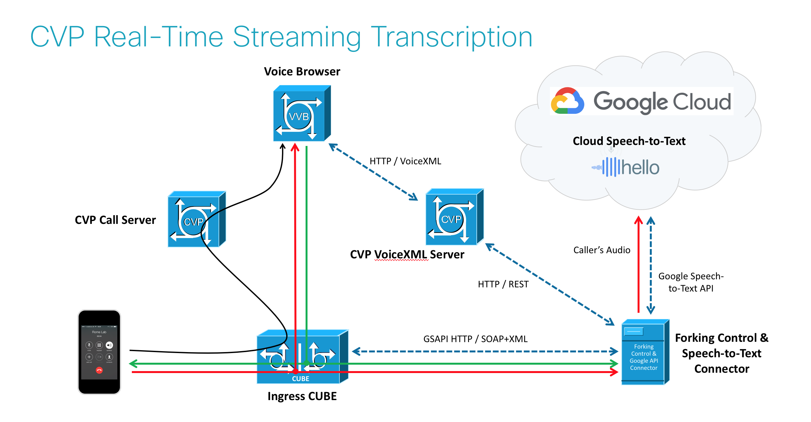

# cisco-cvp-streaming-transcription

Gateway media forking control and streaming transcription using Google Speech-to-Text API.

Provides a simple microservice approach to controlling media forking at the gateway.
Its primary use is to allow a CVP or desktop application to send the caller media stream to an
external server for processing such as transcription or sentiment analysis.

From CVP Call Studio just use the built-in REST Client element to invoke the web app.
For testing use Postman or similar.
The call leg ID to use in the request URL path is the CVP callid variable which is the same as
the VRU leg call GUID and user.media.id variable in ICM.

**Operations**

      Start media forking from the gateway.
      Stop media forking.
      Combined media forking and transcription using streaming to Google Speech-To-Text service.

**HTTP PUT request URLs**

      http://<host:port/path>/forking/<call_leg_ID>
      http://<host:port/path>/transcription/<call_leg_ID>

**Request JSON body items for transcription**

      party           CALLING or CALLED (case independent, optional, defaults to the caller's media stream)
      language        Language locale code (optional, default is en-US)
  
      Example
      
      {"party": "calling",
       "language": "en-GB"}
      
**Request JSON body items for forking control**

      action          START or STOP
      calling         Target address and port
      called          Target address and port
      
      Examples
      
      {"action":"START",
	     "calling" : {"address": "10.61.196.19", "port": "16400"},
	     "called" : {"address": "10.61.196.19", "port": "16401"}}
       
      {"action":"STOP"}
      
**Servlet initialisation parameters**

Configure in your web.xml or servlet annotation in the code.

      GatewayHostList Comma separated list of gateway hostnames or IP addresses
      ListenAddress   IP address for receiving gateway XMF notifications
      ListenPort      IP port for receiving gateway XMF notifications and servlet requests
      ListenPath      Servlet URL path for gateway XMF notifications
      
**Gateway XMF provider configuration**

The remote URL points to your media forking control servlet, to which call notifications will be sent from the gateway. It also has to match the application registration message sent to the gateway by the forking web application when it starts up and initiates communication with the XMF provider.

      uc wsapi
        provider xmf
          remote-url http://10.61.68.102:9090/forkctrl/forking

**Using Google Speech-to-Text API**

https://cloud.google.com/speech-to-text/docs/quickstart-client-libraries for information on enabling access and configuring the environment variable GOOGLE_APPLICATION_CREDENTIALS.

**Things still to be done**

      Complete documentation and explanatory notes / diagram.
      Use double buffering or a pool per UDP channel to minimise packet loss under load.
      Handle session reconnection after break or initial failure to connect.
      Re-registration after keepalives missed and session closed at the gateway.
      Add configurable debug and logging especially to turn RTP stream diagnostic messaging on/off.
      Check safe across multiple concurrent servlet requests, synchronise transaction ID etc.

